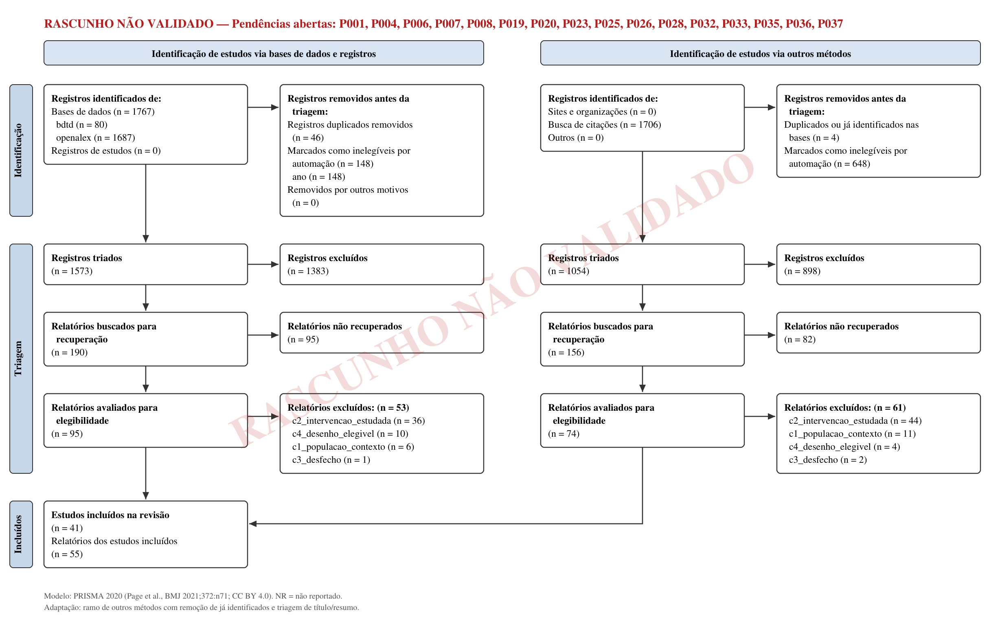
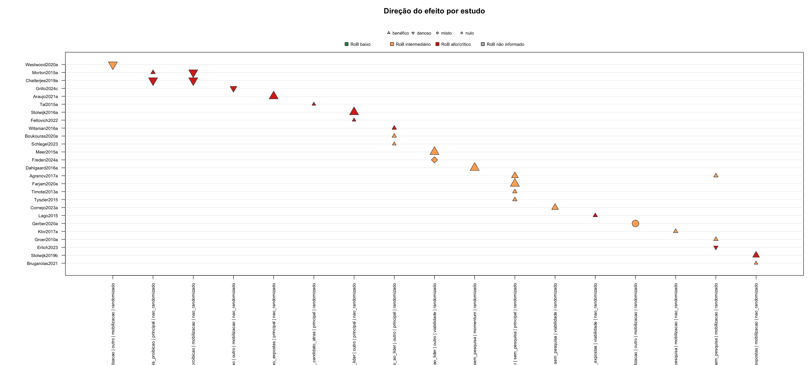
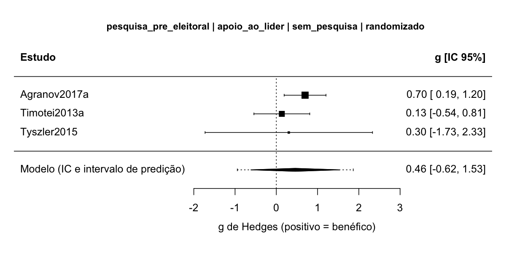
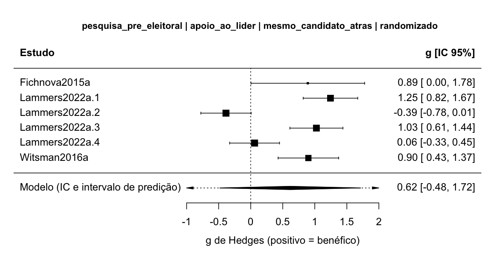

<!--
Manuscrito reescrito em 24/09/2026 a partir de 07-relatorio/prompt_redator_v2.md (PRISMA 2020 com SWiM e PRISMA-S).
Todos os números vêm de arquivos do projeto: 07-relatorio/prisma_contagens.json, 01-busca/, 02-triagem/, 03-textos/,
04-qualidade/, 05-decomposicao/, 06-analise/, 08-revisao-humana/ e 07-relatorio/declaracao_uso_ia.md.
As tabelas grandes foram geradas por 07-relatorio/gerar_tabelas_relatorio.py a partir desses arquivos.
Rascunho redigido por subagente de IA (claude-opus-5-5).
-->

::: {.callout-warning}
## RASCUNHO NÃO VALIDADO — 18 pendências humanas abertas (lista no apêndice)

Este manuscrito ainda tem validações humanas pendentes. Triagem, elegibilidade, extração, risco de viés e certeza foram feitos por subagentes de IA sem validação humana (atalho A2 do protocolo), e decisões antes registradas como humanas foram corrigidas pela Emenda 6a. Não cite como resultado final.
:::

# Resumo {.unnumbered}

**Contexto e objetivos.** Pesquisas eleitorais publicadas estão entre as informações mais difundidas das campanhas, e o debate sobre restringir sua divulgação depende de saber se a exposição a elas muda o voto e em que direção. Esta revisão reúne a evidência causal publicada desde 2010 sobre o efeito da exposição a resultados de pesquisas eleitorais na intenção e na escolha de voto, separando o efeito *bandwagon* (a favor de quem lidera) do *underdog* (a favor de quem está atrás), e sobre o comparecimento.

**Métodos.** Critérios de elegibilidade: eleitores ou participantes que escolhem entre candidatos, partidos ou opções de referendo, em eleição real, hipotética ou de laboratório; exposição a resultado de pesquisa eleitoral (pesquisa pré-eleitoral, agregador ou projeção, boca de urna antes do fechamento das urnas e, por emenda, apuração parcial oficial durante a votação); desfecho de voto ou de comparecimento; experimentos, experimentos naturais, quase-experimentos com variação identificada ou painéis individuais; estudos primários publicados desde 2010, em qualquer idioma. Fontes: OpenAlex (estratégias em inglês, português e espanhol), BDTD e três rodadas de busca por citação no OpenAlex, com última busca nas bases em 19/09/2026 e última rodada de citação em 20/09/2026. Risco de viés: RoB 2 para experimentos aleatorizados, ROBINS-I V2 para experimentos naturais, quase-experimentos e painéis individuais, e EPOC para proibições e embargos com unidades agregadas. Síntese: síntese sem meta-análise (SWiM) por célula (formato de exposição × desfecho × comparador × célula de alvo × classe de desenho), com contagem de direção pelo estimador pontual e teste de sinal binomial exato; certeza pelo GRADE; meta-análise só exploratória. Revisão rápida conduzida por subagentes de IA: triagem, elegibilidade, extração, risco de viés e certeza não têm validação humana. Os 336 registros sem resumo, antes excluídos pelo título, foram triados de novo por IA com resumos recuperados (Emenda 6b), e os efeitos principais dos 40 estudos com dados foram reextraídos às cegas e arbitrados por IA antes da síntese.

**Resultados.** Foram incluídos 41 estudos (55 relatos). Os 560 efeitos extraídos vêm de 40 estudos, e 37 estudos têm ao menos um efeito principal; os tamanhos de amostra estão em unidades diferentes e não foram somados. A SWiM principal reuniu 27 estudos em 18 células do protocolo. Ficaram fora dela 3 estudos em risco de viés crítico e 7 cujos efeitos principais estão todos fora da contagem, por não estimarem o contraste da exposição ou por conferência pendente. As duas células mais povoadas têm 4 experimentos cada, todos na direção *bandwagon*: mostrar uma pesquisa, frente a não mostrar (proporção 1,00; IC 95% 0,40 a 1,00; teste de sinal p = 0,125; 3 dos 4 com preferências induzidas ou vinheta hipotética), e mostrar o candidato à frente, e não atrás (proporção 1,00; IC 95% 0,40 a 1,00; p = 0,125; os 4 em laboratório ou vinheta hipotética e em risco de viés alto). Nas duas, é muito incerto se a exposição aumenta o apoio a quem aparece à frente (certeza muito baixa). As demais células de apoio, de viabilidade e de *momentum* têm 1 ou 2 estudos, todas com certeza muito baixa. No comparecimento, receber uma pesquisa de disputa apertada, e não folgada, provavelmente não muda o comparecimento além de 2 pontos percentuais (1 experimento de campo, nulo por ±δ; certeza moderada); ter visto a divulgação de pesquisas pode aumentar o comparecimento ou a intenção de votar (2 de 2 estudos não randomizados; IC 95% 0,16 a 1,00; certeza baixa); ver projeções mais distantes de 50:50 pode reduzir a decisão de votar (1 jogo online; certeza baixa); e é muito incerto se a boca de urna reduz o comparecimento (certeza muito baixa). Duas meta-análises exploratórias, com comparabilidade limitada e inferência robusta não confiável, deram estimativas com IC que cruza zero: na célula pesquisa × sem pesquisa (3 estudos, 4 efeitos), g = 0,48 (IC 95% −1,51 a 2,47; 1,25 graus de liberdade); na célula mesmo candidato à frente × atrás (3 estudos, 6 efeitos, com desfechos em escala Likert, posto e proporção), g = 0,62 (IC 95% −0,48 a 1,72; 1,46 graus de liberdade). A certeza das duas é a das células (muito baixa). Numa análise descritiva decidida depois de ver os dados, que junta formatos e comparadores, 9 de 9 experimentos foram na direção *bandwagon* (IC 95% 0,66 a 1,00; p = 0,004), mas só 1 deles em contexto real, e é muito incerto se a exposição aumenta o apoio ao líder (certeza muito baixa). O único estudo brasileiro trata da divulgação oficial de apuração parcial, não de pesquisa.

**Discussão.** Limitações da evidência: poucos estudos por célula, predomínio de laboratório e vinheta hipotética, imprecisão, dados lidos de figura e ausência de meta-análise principal. Limitações do processo: fontes restritas; triagem, elegibilidade, extração, risco de viés e certeza feitas por IA, sem validação humana. Interpretação: a direção dominante nos experimentos é *bandwagon*, mas a certeza é muito baixa em todas as células de apoio ao líder, a certeza qualifica a direção e não a magnitude, e nenhum estudo trata de pesquisas no Brasil.

**Outras informações.** Financiamento: nenhum financiamento específico. Registro: não registrado; protocolo congelado com sha256 no log do projeto.

# Introdução

## Justificativa (3)

Pesquisas eleitorais publicadas são uma das informações mais difundidas nas campanhas. Desde 2010, o ambiente informacional mudou: agregadores de pesquisas e projeções probabilísticas ganharam espaço, e os resultados circulam por redes sociais, em contraste com o modelo anterior de pesquisa telefônica e imprensa tradicional. Ao mesmo tempo, o debate público sobre restringir a divulgação de pesquisas (proibições e embargos perto da eleição) depende de saber se a exposição altera o voto e em que direção.

A teoria da exposição do protocolo prevê canais de sinais opostos. A pesquisa pode aumentar o apoio a quem lidera pela percepção de viabilidade e pelo cálculo estratégico, pela heurística de consenso ou pela conformidade (*bandwagon*), ou aumentar o apoio a quem está atrás por simpatia ou preocupação com equidade (*underdog*). Pode ainda reduzir o comparecimento por complacência (desmobilização), efeito não intencional tratado aqui como desfecho próprio. Como os canais podem se anular, um efeito médio próximo de zero não indica ausência de efeito individual.

A última síntese formal identificada sobre efeitos de pesquisas publicadas é a de @Hardmeier2008, uma síntese com meta-análise cujo último ano de busca não foi verificado (capítulo sem texto aberto). @MoyRinke2012 fizeram uma revisão narrativa, sem protocolo nem busca sistemática, e @Barnfield2019, uma revisão conceitual da pesquisa sobre o efeito *bandwagon*. A checagem de revisões existentes e registradas (OpenAlex, OSF Registries e BDTD, em 19/09/2026) não achou síntese sobre efeitos de pesquisas publicadas no voto posterior a 2008 nem revisão registrada em andamento. Esta revisão atualiza a evidência com protocolo, busca documentada, risco de viés por desenho e certeza por célula, e acrescenta uma seção sobre Brasil e América Latina.

## Objetivos (4)

Pergunta principal: a exposição a resultados de pesquisas eleitorais publicadas altera a intenção ou a escolha de voto do eleitorado, em comparação com a não exposição ou com a exposição a outro resultado, e em que direção (*bandwagon* ou *underdog*)?

Perguntas secundárias: (a) a exposição reduz o comparecimento (desmobilização)? (b) por quais mecanismos? (c) para quem, onde e quando o efeito é maior ou muda de sinal? (d) os achados diferem entre Brasil e América Latina e as demais regiões? Os elementos PECO são: P, eleitores ou participantes que escolhem entre candidatos, partidos ou opções, e unidades eleitorais agregadas; E, contato com resultado de pesquisa eleitoral, em três formatos (pesquisa pré-eleitoral, agregador ou projeção, boca de urna antes do fechamento das urnas); C, não exposição, o mesmo candidato mostrado atrás, outro resultado, antes e depois de proibição ou unidades não expostas; O, apoio ao que a pesquisa mostra à frente (`apoio_ao_lider`) e comparecimento (`mobilizacao`). É uma avaliação *ex post* de um fenômeno, não de um programa.

# Métodos

O protocolo (`00-protocolo/protocolo.md`) foi aprovado pelo `revisor_humano_1` no portão G2 em 19/09/2026 e congelado com sha256 no log do projeto. O tipo é revisão sistemática de efetividade com síntese sem meta-análise (SWiM), com meta-análise prevista só nas células com pelo menos três estudos comparáveis, na **variante rápida**. Os atalhos, aprovados pelo `revisor_humano_1` no G1 (A1 a A4) e no G2 (A5), foram:

1. (A1) fontes restritas a OpenAlex e BDTD, mais bola de neve pelo OpenAlex, sem WoS, Scopus e SciELO;
2. (A2) triagem, elegibilidade, extração, risco de viés e certeza feitas por subagentes de IA, sem validação humana;
3. (A3) âncoras de validação da busca montadas por subagente isolado;
4. (A4) PRESS feito só por subagente;
5. (A5) sem contato com autores para textos ou dados faltantes.

A revisão foi conduzida em modo autopiloto no Claude Code, com a skill `revisao-sistematica`. Um coordenador de IA redigiu artefatos, executou os scripts e distribuiu o trabalho entre subagentes de modelos da Anthropic, com papéis fixos por etapa. O coordenador foi o Claude Opus 5.5 (`claude-opus-5-5`, com contexto de 1M); o log não registra o modelo do coordenador, e o protocolo previa `claude-opus-5`. Os papéis dos subagentes foram:

- na triagem de títulos e resumos, A = `claude-sonnet-5` e B = `claude-opus-5`; na triagem complementar dos registros sem resumo (Emenda 6b), A = `claude-sonnet-5` e B = `claude-opus-5-5`;
- na elegibilidade e na extração, subagentes `claude-opus-5`, com recodificação cega por `claude-sonnet-5`; as fichas de texto completo feitas depois da Emenda 6b, a reextração cega dos efeitos principais e a arbitragem dos efeitos, por `claude-opus-5-5`;
- no risco de viés, A = `claude-opus-5-5`, B = `claude-sonnet-5` e árbitro `claude-opus-5-5` em contexto novo;
- no rascunho do GRADE, `claude-opus-5-5`;
- nas sugestões de terceiro leitor preparadas para as pendências humanas e na pré-revisão PRESS da estratégia ativa, `claude-opus-5-5`.

Os portões G3 a G9 foram aprovados em autopiloto quando as checagens de artefato do script passaram, e cada aprovação abriu uma pendência de revisão humana. O único humano, `revisor_humano_1`, aprovou G1 e G2, decidiu a Emenda 1, as 17 decisões de casos limítrofes de texto completo, as convenções da Emenda 4 (itens 4a a 4c, por questionário) e a Emenda 6b, e escolheu por custo o árbitro do risco de viés (Emenda 3). Em 23/09/2026, o revisor declarou que não conferiu outras decisões que o log registrava como suas; a correção está na Emenda 6a e é detalhada em Limitações do processo.

## Critérios de elegibilidade (5)

| Critério | Inclui | Exclui |
|---|---|---|
| C1 População e contexto | Eleitores ou participantes que escolhem entre candidatos, partidos ou opções de referendo ou plebiscito, em eleição real, hipotética ou de laboratório (inclusive com preferências induzidas), em qualquer país; unidades eleitorais agregadas | Escolhas de consumo, mercado, tecnologia ou finanças; votações de órgãos deliberativos reais |
| C2 Exposição estudada como objeto empírico | Resultado de pesquisa eleitoral (pré-eleitoral, agregador ou projeção, boca de urna antes do fechamento das urnas) e, pela Emenda 1, divulgação oficial de apuração parcial enquanto a votação ainda ocorre; manipulada, com variação natural identificada ou medida no indivíduo | Pesquisa só como contexto ou fonte de dados; precisão e metodologia de pesquisas; resultados de eleições passadas, mercados de apostas, métricas de redes sociais |
| C3 Desfecho | Intenção de voto, escolha de voto ou votação agregada que permita comparar o apoio ao que a pesquisa mostra à frente com o apoio ao que mostra atrás; ou comparecimento real, validado, agregado ou intenção de comparecer | Só avaliação ou simpatia, só expectativa de vitória, só busca de informação |
| C4 Desenho | Experimento aleatorizado (survey, laboratório, campo, online); experimento natural ou quase-experimento com variação identificada; painel individual com exposição medida antes do desfecho | Observacional agregado sem variação identificada (*momentum* de pesquisas comparado ao resultado); percepção autodeclarada de influência; simulação; estudo qualitativo, normativo ou teórico |
| C5 Estudo primário | Estudo com análise própria de dados | Revisões e meta-análises (usadas como sementes e fonte de âncoras) |
| C6 Sem retratação | Sem aviso de retratação | Retratado |

: Critérios de elegibilidade do protocolo (seção 4). {#tbl-criterios}

Relatos publicados de 01/01/2010 até a data da última busca (ano de publicação do OpenAlex; ano de defesa na BDTD), sem restrição de idioma nem de status de publicação. A falta de dado numérico não excluía estudos: eles entravam pela direção ou eram listados. Texto não obtido foi registrado como não recuperado, nunca como excluído. Agrupamento para as sínteses: célula = família de exposição × construto × comparador × célula de alvo × classe de desenho (randomizado ou não randomizado), como detalhado em Métodos de síntese.

## Fontes de informação (6)

| Fonte (plataforma) | Data da última consulta |
|---|---|
| OpenAlex, estratégia em inglês, B05 (API, título e resumo) | 19/09/2026 |
| OpenAlex, estratégia em português, B02 (API, título e resumo) | 19/09/2026 |
| OpenAlex, estratégia em espanhol, B03 (API, título e resumo) | 19/09/2026 |
| BDTD, IBICT, B04 (API VuFind, todos os campos) | 19/09/2026 |
| Busca por citação para trás e para frente no OpenAlex, SN1 (38 sementes) | 19/09/2026 |
| Busca por citação no OpenAlex, SN2 (12 sementes) | 20/09/2026 |
| Busca por citação no OpenAlex, SN3 (3 sementes) | 20/09/2026 |

: Fontes consultadas. {#tbl-fontes}

A busca B01 (OpenAlex em inglês, estratégia S-oa-en-v4, 1.235 registros) foi substituída pela B05 depois do teste de recall (E002) e ficou fora dos identificados. Não houve busca em WoS, Scopus, SciELO nem em literatura cinzenta por sites, e não houve contato com autores (atalhos A1 e A5). As sementes da bola de neve foram os incluídos no texto completo e as revisões achadas na checagem de revisões existentes. Na triagem complementar da Emenda 6b, os resumos dos registros sem resumo foram procurados em fontes legítimas, nesta ordem: OpenAlex, Crossref, Semantic Scholar, Europe PMC e metadados da página do DOI.

## Estratégia de busca (7)

Estratégias completas, exatamente como executadas, no apêndice (PRISMA-S). A estratégia tem quatro fios unidos por OR: pesquisa ou projeção com efeito nomeado (*bandwagon* ou *underdog*); survey eleitoral com efeito nomeado; frases de exposição a resultado de pesquisa com frases de desfecho de voto; e frases de exposição com comparecimento. No OpenAlex, a busca usou o campo título e resumo, com filtro de ano de publicação de 2008 a 2026 (margem de dois anos; a exclusão efetiva pelo ano de 2010 foi feita pelo funil formal); na BDTD, todos os campos, sem limite. Uma pré-revisão PRESS 2015 por subagente (atalho A4) levou à versão S-oa-en-v4 (E001). A validação por âncoras (19 âncoras montadas por subagente isolado, a partir das referências de @MoyRinke2012 e @Barnfield2019 e das citações para frente de @Hardmeier2008) recuperou 15 de 19 na S-oa-en-v4 (0,79; IC 95% 0,54 a 0,94), com 4 de 8 âncoras independentes; a estratégia foi ampliada (S-oa-en-v5) e recuperou 19 de 19 (1,00; IC 95% 0,82 a 1,00). Como as 4 âncoras perdidas orientaram a correção, esse recall final não é evidência independente de sensibilidade. Não houve âncora em português ou espanhol, e B02 a B04 ficaram sem validação de recall. Em 23/09/2026, um subagente (`claude-opus-5-5`) fez nova pré-revisão por IA, agora da estratégia ativa S-oa-en-v5 e das estratégias em português, espanhol e da BDTD (`08-revisao-humana/P001_press/prepress_S-oa-en-v5_ia.md`); ela não substitui o PRESS humano (pendência P001), e suas lacunas estão em Limitações do processo. Outros métodos: três rodadas de busca por citação para trás e para frente (SN1 a SN3), re-triadas com os mesmos critérios.

## Processo de seleção (8)

Depois da deduplicação e do filtro determinístico por ano de publicação, dois revisores de IA independentes (A = `claude-sonnet-5`; B = `claude-opus-5`) triaram títulos e resumos em lotes de 25 registros, com os critérios versionados `02-triagem/prompts/ta_v1.md` (sha256 `cd9cbfe00d4e4e45`). A consolidação seguiu a regra liberal: bastava um revisor incluir ou marcar incerto para o registro seguir ao texto completo. As divergências (81 ao fim das rodadas) ficaram na fila humana só para relato, sem arbitragem; para ajudar a decisão humana, um terceiro leitor de IA (`claude-opus-5-5`), sem ver os pareceres, sugeriu excluir 47 e marcar 34 como incertos (`08-revisao-humana/P020_triagem/`), sem efeito no fluxo.

**Registros sem resumo (Emenda 6).** Na primeira rodada, 336 registros sem resumo receberam dos dois triadores de IA uma proposta de exclusão pelo título, registrada no ledger como decisão conferida e assumida pelo `revisor_humano_1`. Em 23/09/2026 o revisor declarou que não as conferiu (Emenda 6a) e decidiu que nenhum registro seria excluído só pelo título (Emenda 6b). Os 336 passaram por uma triagem complementar feita só por IA, cuja conferência humana o revisor dispensou. O resumo foi recuperado em fontes legítimas para 172 registros (3 deles só com o resumo automático de uma frase do Semantic Scholar, que não serve de base para exclusão), e 164 ficaram sem resumo. Dois triadores independentes (A = `claude-sonnet-5`; B = `claude-opus-5-5`) aplicaram os critérios congelados da `ta_v1`, sem mudança, com a mesma regra liberal: um registro só era excluído se os dois excluíssem, cada um com critério e trecho literal do resumo recuperado. Resultado: 156 exclusões e 180 registros enviados ao texto completo (164 sem resumo e 16 com resumo em que ao menos um triador não excluiu). As decisões entraram no ledger por `triagem override --por ia_coordenador_emenda6`, único caminho do `rs.py` para substituir as linhas antigas (`02-triagem/sem_resumo_revisao/`).

**Texto completo.** Um subagente por PDF propôs a elegibilidade com trecho literal e página, conferidos pelo verificador de citações da skill `fichamento-sistematico`. Os casos incertos e limítrofes do primeiro fluxo foram decididos pelo `revisor_humano_1` (17 decisões, Emenda 6a); em 3 casos, a IA estendeu a caso novo uma regra que o revisor tinha decidido para outro grupo, sem conferência humana. As 165 decisões propostas a partir das fichas (47 de inclusão e 118 de exclusão) aguardam conferência humana (P041). Relatos do mesmo estudo foram ligados antes da extração, e as retratações foram checadas no OpenAlex e na Crossref (nenhuma entre os 55 relatos incluídos).

**Automação e validação.** Ferramentas de automação: subagentes de IA do Claude Code (modelos acima), filtro de ano e deduplicação por script. Validação humana: recall NR (IC 95% NR) e κ NR, porque a amostra de validação (141 registros) e a de elusão (300 registros) foram preparadas, mas não codificadas por humanos (P006 e P007). Como medidas de consistência, e não de acurácia, a concordância entre A e B na primeira onda foi 0,97 (κ 0,90; PABAK 0,94), e a re-triagem de 158 registros deu κ 0,93 para A (3 mudanças de seguimento, absorvidas pela regra liberal) e κ 1,00 para B. Nenhuma âncora de validação foi excluída pela triagem de IA.

## Processo de coleta de dados (9)

A extração usou o codebook `00-protocolo/codebook_v0_efetividade.csv`, com variáveis próprias desta literatura (`regiao`, `tipo_eleicao`, `sistema_eleitoral`, `voto_obrigatorio`, `desenho_fino`, `realismo_contexto`, `ano_eleicao`, `comparador_tipo`, `alvo_efeito`, `ajuste_mediador`, entre outras). Um piloto com três estudos de desenhos diferentes (@Meer2015a, @Klor2017a e @Araujo2021a) levou à Emenda 2, decidida pelo coordenador de IA, e não pelo revisor humano (Emenda 6a). Na rodada completa, um subagente `claude-opus-5` por texto preencheu a ficha, com trecho literal e página para cada variável, conferidos pelo verificador de citações; as citações reprovadas foram corrigidas pelo coordenador contra a camada de texto do PDF. Os dados de efeito foram extraídos por subagentes com trecho e página e conferidos por script. Na versão atual, são 560 efeitos de 40 estudos: 560 trechos localizados, nenhum erro de plausibilidade e 32 avisos de |g| > 2 para conferência. Variáveis faltantes para a conversão e alvos ambíguos foram complementados por subagentes Opus, com trecho e página. Um segundo subagente (`claude-sonnet-5`) recodificou às cegas 10 estudos sorteados; para as 259 divergências, um terceiro leitor de IA (`claude-opus-5-5`) sugeriu o valor sustentado pelo texto, sem aplicar nada (`08-revisao-humana/P037_concordancia/`).

**Reextração cega e arbitragem dos efeitos principais (23 e 24/09/2026).** Para preparar a conferência humana dos efeitos (P039), um subagente `claude-opus-5-5` reextraiu às cegas, sem ver a extração original, os efeitos do modelo principal dos 40 estudos com dados (`08-revisao-humana/efeitos/prompt_reextracao_cega.md`). Um script comparou as duas extrações nos 56 efeitos principais originais: 15 concordaram, 23 tinham o mesmo valor com classificação diferente, 12 tinham outro valor principal e 6 tinham sinal diferente. Nos 28 estudos com divergência, um árbitro de IA (`claude-opus-5-5`, um PDF por agente) decidiu pelo texto e pelas convenções do projeto, com trecho e página (`08-revisao-humana/efeitos/arbitragem/`). O coordenador aplicou 772 correções (`05-decomposicao/correcoes_sessao_2026-09-23.csv`): 531 propostas diretamente pelo árbitro, 240 extensões da recomendação do árbitro a linhas análogas do mesmo estudo e 1 do próprio coordenador. Outras 41 propostas não foram aplicadas (`08-revisao-humana/efeitos/aplicacao_arbitragem.csv`): 40 trocas do estimando de diferença em diferenças em @Morton2015a, que vinham de um erro do prompt do árbitro e foram barradas antes da aplicação, e 1 sugestão de sistema eleitoral para @Brugarolas2021 baseada em conhecimento externo. Qualquer correção derruba `verificado_humano`, e nenhum efeito foi conferido por humano na página do texto completo (P039, 560 efeitos). Não houve contato com autores (atalho A5).

## Itens de dados (10a, 10b)

Desfechos: `apoio_ao_lider` (intenção de voto, escolha declarada, escolha incentivada em experimento ou votação agregada do candidato, partido ou opção que a pesquisa mostra à frente) e `mobilizacao` (comparecimento declarado, validado ou agregado, ou intenção de comparecer). O alvo do efeito foi registrado por linha: a célula principal de `apoio_ao_lider` recebeu só efeitos sobre quem a pesquisa mostra à frente (líder, opção de referendo) ou atrás (azarão, com sinal invertido). Efeitos sobre o segundo viável, o terceiro inviável ou o partido perto da cláusula de barreira formaram a célula de viabilidade, e efeitos de ganho ou perda de apoio sem posição mostrada formaram a célula de *momentum* (Emenda 4b; @Dahlgaard2016a desde a Emenda 4, e @Meer2015a, @Stolwijk2016a e @Unkelbach2022a depois da arbitragem de 23/09/2026). Todos os resultados compatíveis foram extraídos, e a regra de modelo principal, escrita antes da extração, escolheu um por contraste: o declarado principal pelos autores; na falta, o usado na interpretação; depois, a regra do protocolo; nunca o mais significativo. Efeitos ajustados pela expectativa de vitória (efeito direto) não foram agregados com efeitos totais.

Outras variáveis: desenho fino, estimando (ATE, ITT, LATE, ATT, associação), família de exposição, comparador, realismo do contexto (real, hipotético, induzido), tipo de eleição, sistema eleitoral e número de competidores, voto obrigatório, região (Brasil, América Latina, outras), ano da eleição, dias até a eleição, mecanismo testado, moderadores relatados e subgrupos PROGRESS-Plus (escolaridade, posição socioeconômica, idade). Pressupostos para informação ausente ou pouco clara: `999` para não relatado; conglomerados sem ICC relatado com ICC imputado de 0,05 (Emenda 4c); logit sem efeito marginal convertido por OR = exp(β), marcado como aproximado; probit sem efeito marginal só na síntese por direção.

## Avaliação do risco de viés (11)

Ferramenta por desenho, julgada por domínio e por resultado: RoB 2 para experimentos aleatorizados individuais e por conglomerado (variante D1b); ROBINS-I V2 para experimentos naturais e quase-experimentos com dados individuais e para painéis individuais; EPOC para proibições, embargos ou calendários com unidades agregadas. Para exposição não atribuída (painéis e estudos observacionais), a ferramenta canônica seria o ROBINS-E; como a skill não tem codebook dele, usou-se o ROBINS-I V2, com a limitação declarada. Os codebooks foram copiados para o protocolo antes de qualquer avaliação (Emenda 3), com os confundidores do DAG (`apoio_latente`, `interesse_politico`, `preferencia_previa`). Os subagentes A (`claude-opus-5-5`) e B (`claude-sonnet-5`) avaliaram cada resultado de forma independente, com trecho literal e página conferidos pelo verificador de citações. Onde concordaram, o consenso foi automático; nos desacordos, o árbitro (`claude-opus-5-5`, em contexto novo, sem ver a própria avaliação A) propôs o consenso com trecho. A Emenda 4d registrava que o `revisor_humano_1` tinha confirmado as 88 propostas em bloco; a Emenda 6a corrigiu esse registro, porque a confirmação não aconteceu, e `resolvido_por` passou a `arbitro_ia:claude-opus-5-5`. O geral saiu do algoritmo de cada ferramenta; no EPOC, os critérios de sequência aleatória e de ocultação da alocação ficaram fora do geral, porque são altos por definição em todo quase-experimento com grupo controle (Emenda 4a).

## Medidas de efeito (12)

g de Hedges alinhado à direção convencionada de cada desfecho (Emenda 5, item 2):

- em `apoio_ao_lider`, `direcao_desejada = aumentar` para líder, opção de referendo e segundo viável, e `reduzir` para azarão, terceiro inviável e partido perto da cláusula. Na célula principal, g positivo = *bandwagon* e negativo = *underdog*; na célula de viabilidade, positivo = mais apoio à opção mostrada como viável ou menos à mostrada como inviável;
- nos desenhos de proibição (@Chatterjee2019a, @Morton2015a), o efeito da proibição foi reorientado para o efeito da exposição;
- em `mobilizacao`, positivo = mobilização e negativo = desmobilização.

A convenção é técnica e não carrega juízo normativo. Proporções, efeitos em pontos percentuais e razões de chances foram convertidos a d pelo log OR com a proporção do grupo de comparação (d = ln(OR)·√3/π), e as conversões aproximadas foram marcadas. Na SWiM, a medida é a direção do estimador pontual e a proporção de estudos na direção positiva, com IC 95% exato.

## Métodos de síntese (13a-13f)

- **13a Elegibilidade para cada síntese:** célula = família de exposição × construto × comparador × célula de alvo (principal, viabilidade, *momentum*, mobilização) × classe de desenho (Emenda 5, item 1). Randomizados e não randomizados nunca foram agregados juntos, e contrastes antes e depois dentro do sujeito passaram à classe não randomizada (Emenda 5, item 6). A classe foi atribuída pelo script da skill a partir do campo `desenho`. Resultados em risco de viés crítico ficaram fora da análise principal e entraram numa sensibilidade. Efeitos principais que não estimam o contraste da exposição (interações com moderadores contínuos, contrastes de formato da mesma previsão, alvos opostos agregados) e os de conferência pendente ficaram fora do teste de sinal, com o motivo registrado no dicionário `FORA` de `06-analise/montar_entradas_swim.py`; eles entram na síntese narrativa e numa sensibilidade (Emenda 5, item 4). O dicionário foi atualizado depois das arbitragens de 23/09/2026 (@tbl-fora).
- **13b Preparação dos dados:** conversões com fórmula registrada; conversões aproximadas marcadas. Estudos sem t, β ou r receberam o sinal do efeito em pontos percentuais, de p1 − p0 ou de ln(OR), só para a direção (Emenda 5, item 9). Efeito principal com IC 95% inteiro dentro de ±δ foi classificado como nulo (Emenda 5, item 8). O sinal de efeitos estimados como efeito da proibição foi invertido para o efeito da exposição (Emenda 5, item 3). Conglomerados sem ICC: variância multiplicada por 1 + (m − 1)·ICC, com ICC = 0,05 na análise principal e 0,20 na sensibilidade (Emenda 4c). Dados faltantes: sem contato com autores; estudos sem dado utilizável entraram pela direção ou foram listados.
- **13c Tabulação e gráficos:** tabela de características ordenada por estudo; tabela de resultados individuais; tabela de direção por célula com estudos, direções, proporção, IC e p do teste de sinal; gráfico de direção do efeito (*effect direction plot*) e *forest plots* das duas meta-análises exploratórias.
- **13d Síntese:** sem meta-análise principal. Pelo protocolo, a meta-análise usaria efeitos aleatórios por REML com Hartung-Knapp, τ² com IC, I² e intervalo de predição (metafor 5.0.1), randomizados e não randomizados em separado, só com pelo menos 3 estudos (`--k-min 3`), e dependência por CHE com RVE (CR2), ρ = 0,6, com sensibilidade em 0,2, 0,5 e 0,8 e graus de liberdade de Satterthwaite abaixo de 4 lidos como não confiáveis. Depois da Emenda 5, a síntese principal é só SWiM. Duas células randomizadas de apoio ao líder reúnem 3 estudos com g calculado e tiveram meta-análise pelo protocolo (seção 8, k ≥ 3), CHE (REML) com RVE (CR2), ρ = 0,6, sem resultados em risco crítico, ambas tratadas como exploratórias. A primeira, pesquisa pré-eleitoral × sem pesquisa (`06-analise/meta_exploratoria/`, δ = 0,0573), inclui @Tyszler2015, com dois efeitos principais lidos de figura. A segunda, pesquisa pré-eleitoral × mesmo candidato atrás (`06-analise/meta_mesmo_candidato/`, entrada `06-analise/meta_entrada_mesmo_candidato.csv`, δ = 0,044), foi rodada em 24/09/2026, depois das correções dos efeitos; a própria saída avisa que há vários desfechos no mesmo construto (escala Likert, posto e proporção), o que limita a comparabilidade. Sem meta-análise: SWiM, com direção pelo estimador pontual (nunca pela significância), consistência de pelo menos 70% dos efeitos para dar direção a um estudo com vários efeitos, teste de sinal binomial exato bilateral e gráfico de direção. Testes combinados de valores-p não foram rodados (o Stouffer da skill é unilateral e a pergunta é bilateral).
- **13e Heterogeneidade:** os moderadores pré-especificados (`desenho_fino`, `realismo_contexto`, `tipo_eleicao`, `regiao`, ano da eleição antes ou depois de 2010, `sistema_eleitoral` e `n_competidores`) exigiam pelo menos 3 estudos por nível para estimativa e 4 para teste. Nenhuma célula atingiu esse número, e a heterogeneidade foi examinada só pela coerência das direções dentro das células e pelas sensibilidades de realismo e de ano. A hipótese de efeitos opostos que se anulam só seria afirmada com pelo menos 3 estudos com estimativas por subgrupo de sinais opostos.
- **13f Sensibilidade:** na SWiM, com os resultados em risco crítico e com ICC = 0,20 (agrupamento do protocolo) e, no agrupamento amplo, só com contexto real, sem dados anteriores a 2010, sem @Araujo2021a (Emenda 1) e com os efeitos fora da contagem (Emenda 5, item 10). Nas metas exploratórias, *leave-one-out*, ρ e ICC = 0,20. A sensibilidade sem conversões aproximadas não se aplicou a nenhuma das duas (nenhuma linha aproximada). A sem risco alto não se aplicou à primeira (nenhuma linha de risco alto) e não pôde ser rodada na segunda, em que os 6 efeitos estão em risco alto (k restante 0). A de artigo como conglomerado não se aplica sem meta principal.

**Limiar de relevância.** δ = 2 pontos percentuais, convertido em g pelo log OR com a proporção de referência: 0,044 para `apoio_ao_lider` (referência 0,50) e 0,046 para `mobilizacao` (referência 0,60); na célula de pesquisa pré-eleitoral × sem pesquisa × apoio randomizado, 0,0573, com a mediana dos p0 dos efeitos com g da célula (0,73; `06-analise/_delta_celula.txt`). É convenção deste protocolo, sem *benchmark* de campo verificado.

## Avaliação de viés de relato (14)

O protocolo previa funil, Egger, PET-PEESE e modelo de seleção só com 10 ou mais estudos por célula, o que nenhuma célula atingiu. O juízo sobre evidência faltante, inspirado no ROB-ME e sem codebook na skill, foi incorporado ao domínio de viés de publicação do GRADE pelo subagente, com base na limitação de fontes (atalho A1), na triagem refeita só por IA dos registros sem resumo (Emenda 6b), na presença ou ausência de estudos nulos e no tamanho dos estudos. Não há avaliação ROB-ME separada por célula.

## Avaliação da certeza (15)

GRADE por célula de efeito, com randomizados e não randomizados em corpos separados; δ = 2 pontos percentuais convertidos (0,044 para apoio e 0,046 para mobilização; 0,0573 na célula descrita acima). Pontos de partida: randomizados em alta; não randomizados avaliados com ROBINS-I V2 em alta, com rebaixamento por risco de viés; corpos avaliados só com EPOC em baixa; célula com as duas ferramentas em baixa. A indireção considerou o contexto eleitoral e institucional, o realismo (hipotético ou induzido frente a eleição real) e o estimando. Sem meta-análise, a inconsistência foi julgada pela coerência das direções e a imprecisão pelo número de estudos e de participantes e pela largura do IC da proporção de direção, porque o teste de sinal não tem poder com 1 a 4 estudos. Os juízos foram rascunhados em 24/09/2026 por subagente (`claude-opus-5-5`, com `06-analise/prompt_grade_v2.md`), em `06-analise/certeza.csv` (18 células do protocolo) e `06-analise/certeza_agrupamento_amplo.csv` (7 linhas do agrupamento amplo descritivo), todos com `validado_humano = 0` (P036 e P042). Com SWiM, a certeza qualifica a **direção** do efeito, não a magnitude; na célula com efeito nulo por ±δ, qualifica a classificação como nulo ou trivial.

# Resultados

## Seleção dos estudos (16a, 16b)

{#fig-prisma}

A busca identificou 1.767 registros nas bases (1.687 no OpenAlex e 80 na BDTD) e 1.706 por outros métodos (busca por citação). Antes da triagem, foram removidos 46 duplicados, 148 marcados por automação (filtro de ano de publicação anterior a 2010) e 0 por outros motivos nas bases; nos outros métodos, 4 duplicados e 648 pelo filtro de ano. Foram triados 1.573 registros das bases (1.314 excluídos) e 1.054 dos outros métodos (787 excluídos); 259 e 267 relatos foram buscados, 158 e 184 não foram recuperados, 101 e 83 foram avaliados, 59 e 70 foram excluídos, e 0 ficaram aguardando classificação. Motivos de exclusão no texto completo (bases e outros métodos): exposição fora do critério C2, 39 e 50; desenho fora do C4, 10 e 4; população ou contexto fora do C1, 8 e 13; desfecho fora do C3, 2 e 3. Foram incluídos 41 estudos (55 relatos: 42 das bases e 13 dos outros métodos). Os 1.235 registros da busca substituída B01 ficaram fora dos identificados.

A triagem complementar da Emenda 6b mudou o fluxo, mas não o conjunto de incluídos. Dos 180 registros sem resumo que seguiram ao texto completo, 15 foram recuperados por fonte legítima e avaliados, e os 15 foram excluídos (9 por C2, 4 por C1 e 2 por C3); os outros 165 ficaram como não recuperados. Nenhum PDF foi obtido por Sci-Hub ou outra fonte não autorizada: o que não foi obtido por fontes legítimas ficou como não recuperado.

Estudos que pareciam elegíveis e foram excluídos: experimentos de laboratório em que o participante vê a contagem corrente de votos ou o placar do próprio jogo, e não um resultado de pesquisa (Scheuerman2019, Scheuerman2020, Scheuerman2021, Yosef2017, Bischoff2012, Hizen2025, Morton2015b; C2); um experimento natural no Peru em que parte do eleitorado votou depois de conhecer um resultado que juntava bocas de urna e contagem parcial oficial, sem separar as fontes (Reveco2026; C2, decisão humana); um artigo que declara ter exposto parte da amostra a pesquisas mas não analisa esse experimento, cujo projeto é relatado por @Gasperoni2015a (Corbetta2013; C2); um estudo de efeito de terceira pessoa (Kim2018b; C3); jogos em equipe sem escolha eleitoral (Kim2025a; C1); e estudos com a pesquisa como medida agregada, sem variação identificada (Freden2021 e Mavridis2016a; C4). Esses casos estão em `03-textos/notas_c2_limitrofes.md` e `03-textos/elegibilidade_tc_final.csv`, e as chaves não estão na lista de referências porque os textos foram excluídos.

## Características dos estudos (17)

Os 41 estudos incluídos (55 relatos) foram publicados de 2010 a 2024 (ano do relato principal). Os desenhos foram: 14 experimentos de survey, 9 experimentos de laboratório com preferências induzidas, 3 de laboratório com candidatos reais, 1 experimento de campo, 6 experimentos naturais, 3 painéis individuais e 5 outros desenhos. A exposição foi pesquisa pré-eleitoral em 33 estudos, agregador ou projeção em 4, boca de urna em 3 e apuração parcial oficial em 1. O contexto foi real em 25 estudos, com preferências induzidas em 9 e hipotético em 7; 32 estudos trataram de eleições com candidatos ou partidos, 8 de eleições simuladas abstratas e 1 de referendo. Mediram só apoio ao líder 24 estudos, só mobilização 10 e os dois 7. A região foi codificada como Brasil em 1 estudo, América Latina em 1, as três categorias em 1 (corte transversal de 46 países) e não relatada em 1; os outros 37 são de outras regiões, sobretudo Estados Unidos e Europa.

<!-- TABELA:caracteristicas -->

Destino de cada estudo na síntese: 27 entram na SWiM principal; 3 têm os resultados principais em risco de viés crítico e ficam só na sensibilidade (@Gasperoni2015a, que também está no dicionário `FORA`, @Kaplan2019a e @Unkelbach2022a); 7 têm todos os efeitos principais fora da contagem e ficam só na síntese narrativa e na sensibilidade com esses efeitos (@Alabrese2024a, @Bursztyn2023a, @Gandhi2019, @Geers2018, @Lago2015, @Meffert2011, @Urminsky2019); e 4 não têm efeito principal extraído. Em @Freden2016b, o PDF recuperado é o capítulo introdutório da tese; o artigo que manipula pesquisas foi publicado à parte, como Freden2016a no corpus, e não foi recuperado por fonte legítima (`03-textos/sessao_2026-09-23/relatorio_textos_versoes.md`). Em @Meffert2012a, os desfechos restantes não se relacionam ao apoio ao líder (o experimento de laboratório com partidos reais é o de @Meffert2011); em @Tyszler2013, os efeitos misturam deserções para o líder e para outro candidato; em @Yang2023d, os contrastes são entre formatos de apresentação da mesma previsão.

## Risco de viés nos estudos (18)

Foram avaliados 43 resultados de 37 estudos: 23 com RoB 2 (17 com algumas preocupações e 6 em risco alto), 13 com ROBINS-I V2 (2 moderado, 8 grave e 3 crítico) e 7 com EPOC (6 alto e 1 baixo). Nenhum resultado randomizado ficou em risco baixo no geral; o domínio de relato seletivo (D5) teve algumas preocupações em 21 dos 23 resultados avaliados com RoB 2. Nos não randomizados, o confundimento foi grave ou crítico em 11 dos 13 resultados avaliados com ROBINS-I. A concordância entre os avaliadores A e B antes da arbitragem foi baixa: no RoB 2, de 0,43 (D2) a 0,74 (D3 e D4), com 1,00 em D1b; no ROBINS-I, de 0,38 (D1 e D6) a 0,77 (D4); no EPOC, de 0,60 a 1,00. Dos 259 domínios julgados, 171 tiveram consenso automático e 88 foram arbitrados. O árbitro seguiu o avaliador A em 79 dos 88 domínios, B em 7 e propôs terceiro valor em 2; como A e o árbitro são o mesmo modelo, a proporção é declarada como possível viés de afinidade. Nenhum dos 259 julgamentos foi validado por humano (P033). A arbitragem dos efeitos de 23/09/2026 não mudou nenhum julgamento de risco de viés, mas levantou um ponto para a revisão humana: em @Fichnova2015a, 17 dos 37 respondentes eslovacos não aparecem nas tabelas, com D3 julgado baixo.

<!-- TABELA:rob2 -->

<!-- TABELA:robins -->

<!-- TABELA:epoc -->

## Resultados dos estudos individuais (19)

A @tbl-individuais traz os 70 efeitos principais dos 37 estudos que tiveram modelo principal, com o g alinhado à convenção de sinal e o erro-padrão quando calculável, a medida original quando o g não foi calculado e se o efeito entrou no teste de sinal. Estudos com mais de um contraste principal (por exemplo, dois turnos, três partidos-alvo ou dois níveis de um fator) recebem direção pela regra de consistência de 70% dos efeitos.

**Mudanças desde a versão de 23/09/2026.** A reextração cega e as arbitragens (Métodos, item 9) mudaram a extração de 27 estudos. As mudanças que afetam a síntese foram:

- **Braços trocados:** em @Freden2024a, o braço de 2,5% passou a tratamento. Com a troca, a E01 passou a g = −0,41: mostrar o partido abaixo da cláusula aumentou o apoio a ele, e o estudo ficou misto na célula de viabilidade (certeza da célula muito baixa).
- **Contraste da exposição extraído:** em @Lammers2022a e @Fichnova2015a, os efeitos principais antigos mediam, respectivamente, o modo de raciocínio e correlações entre rankings. Eles deixaram de ser principais, e as novas linhas trazem o contraste da posição sorteada (@Lammers2022a E06 a E09; @Fichnova2015a E09 e E10).
- **Comparadores:** 287 linhas passaram de comparador `outro` para `outro_resultado`, 46 para `sem_pesquisa` e 6 para `mesmo_candidato_atras`. Entre elas estão as de @Grillo2024c, em que o turno de comparação também teve boca de urna, divulgada mais tarde, e a E01 de @Witsman2016a, que passou a `mesmo_candidato_atras`. Outras 5 linhas, de @Stolwijk2019b, passaram de `unidades_nao_expostas` para `outro_resultado`.
- **Alvos:** pela Emenda 4b, os alvos principais de @Meer2015a, @Stolwijk2016a e @Unkelbach2022a passaram a `nao_se_aplica`, porque a pesquisa mostrada não informa a posição do partido, e os três foram para a célula de *momentum*. @Schlegel2023 passou de líder a segundo viável e saiu da célula principal.
- **Modelos principais:** em @Alabrese2024a, o modelo principal de apoio passou da probabilidade de vitória para a participação nos votos. Em @Chatterjee2019a, @Tyszler2015, @Geers2018 e @Unkelbach2022a, efeitos antes secundários passaram a principais. Em @Kaplan2019a, o efeito passou de taxa de troca, sem direção, para mudança líquida da intenção de votar (−8,06 p.p., valor derivado).
- **Nova composição das células:** surgiu a célula randomizada de pesquisa × mesmo candidato atrás × apoio principal, com 4 estudos. A célula de viabilidade não randomizada deixou a análise principal, porque o efeito de @Lago2015 é uma interação com moderador contínuo e foi para o dicionário `FORA`. @Araujo2021a aparece com a família `outro`, que é a apuração parcial oficial da Emenda 1.

<!-- TABELA:individuais -->

**Pontos de julgamento deixados para o revisor humano.** Os árbitros levantaram decisões que mudariam a composição das células e não foram aplicadas pelo coordenador, porque seriam decisões novas de síntese tomadas depois de ver os dados (`08-revisao-humana/efeitos/pontos_para_o_revisor.md`). Os principais são:

- se Gerber2020a-E12 (efeito de 1 p.p. de crença sobre o comparecimento, por variável instrumental) vai para o dicionário `FORA`; o nulo da célula não muda, porque a E31 o sustenta;
- se @Feltovich2022 (E01 e E02) vai para o `FORA`, porque os autores tratam a prévia como mecanismo de identificação e não como exposição; com isso, a célula não randomizada de apoio com outro resultado ficaria vazia;
- se @Schlegel2023 vai para o `FORA` ou recebe só uma ressalva: o contraste principal mistura a precisão das pesquisas com a retirada da carga cognitiva, e o contraste só de informação dá cerca de 5,2 p.p., com IC que cruza zero;
- se @Geers2018 volta à contagem: o motivo anterior para excluí-lo partia de uma leitura errada do desvio-padrão, e as duas linhas principais são negativas, de desmobilização;
- o alvo de Witsman2016a-E01, que o autor lê como voto estratégico; se virar viabilidade, o estudo sai da célula mesmo candidato atrás;
- se Klor2017a-E01 volta à contagem, porque o motivo do `FORA` conflita com o comparador `mesmo_candidato_atras`, que o protocolo aceita;
- o comparador de @Grillo2024c (os autores chamam o primeiro turno de grupo controle);
- a regra de ano da eleição em experimentos de laboratório, hoje inconsistente: @Tyszler2015 e @Klor2017a usam o ano da coleta e saem da sensibilidade sem dados anteriores a 2010, enquanto outros usam `999`.

## Resultados das sínteses (20a-20d)

A @tbl-swim resume a SWiM principal, com uma linha por célula do protocolo. Das 19 células, 18 têm estudo em risco não crítico; a de agregador ou projeção × mobilização × sem pesquisa × não randomizado ficou vazia depois da exclusão de @Kaplan2019a (risco crítico). A direção é a do estimador pontual, e o teste de sinal não estima magnitude nem considera a precisão e o tamanho dos estudos. A sensibilidade com ICC = 0,20 (`06-analise/swim_sens_icc020/`) não mudou nenhuma contagem de direção em nenhuma célula.

<!-- TABELA:swim -->

{#fig-direcao}

**Apoio ao líder, pesquisa pré-eleitoral frente a nenhuma pesquisa, randomizados (20a, 20b).** Quatro experimentos (@Agranov2017a, @Farjam2020a, @Timotei2013a, @Tyszler2015), todos com algumas preocupações de risco de viés; três em laboratório com preferências induzidas ou vinheta hipotética e só @Farjam2020a com partidos e organizações reais. Foram 4 de 4 estudos com estimativa na direção *bandwagon* (proporção 1,00; IC 95% 0,40 a 1,00; teste de sinal p = 0,125): é muito incerto se mostrar uma pesquisa, frente a não mostrar, aumenta o apoio à opção mostrada à frente (certeza muito baixa). Em @Agranov2017a e @Tyszler2015, o desfecho é o resultado da eleição do grupo, não o apoio individual. A meta-análise exploratória reuniu os três estudos que têm g (@Agranov2017a, @Timotei2013a e @Tyszler2015, este com dois efeitos principais lidos de figura), com 4 efeitos, por CHE (REML) com RVE (CR2) e ρ = 0,6. O resultado foi g = 0,48 (IC 95% −1,51 a 2,47; p = 0,263), com 1,25 graus de liberdade de Satterthwaite, abaixo de 4: a inferência robusta não é confiável. O IC cruza zero e ±δ (0,0573). τ² = 0,04 e I² = 15% não são interpretáveis com k = 3, e o intervalo de predição (−3,55 a 4,51) não foi interpretado com k < 5. Com ρ = 0,2, 0,5 e 0,8, a estimativa foi 0,49, 0,48 e 0,47, sempre com IC que cruza zero. No *leave-one-out*, a estimativa variou de 0,19 a 0,69; sem @Timotei2013a, ela foi 0,69 (IC 95% 0,40 a 0,98), e o IC deixou de cruzar zero. Com ICC = 0,20, g = 0,51 (IC 95% −0,97 a 1,98). Esta meta-análise é exploratória, não é a síntese principal, e sua certeza é a da célula (muito baixa).

{#fig-forest}

**Apoio ao líder, o mesmo candidato mostrado à frente ou atrás, randomizados (20a, 20b).** Célula nova nesta versão, com 4 experimentos, todos em risco de viés alto e todos em laboratório com preferências induzidas (@Tal2015a) ou vinheta hipotética (@Lammers2022a, @Fichnova2015a, @Witsman2016a). Foram 4 de 4 na direção *bandwagon* (proporção 1,00; IC 95% 0,40 a 1,00; p = 0,125): é muito incerto se ver o candidato à frente numa pesquisa, em vez de atrás, aumenta o apoio a ele (certeza muito baixa). Dentro de @Lammers2022a, os sinais se opõem entre os níveis do fator de modo de raciocínio: g = 1,25 e 1,03 no modo heurístico e −0,39 e 0,06 no modo moral. É modificação de efeito dentro do estudo, e o estudo recebeu direção *bandwagon* pela regra de 70% (3 de 4 efeitos). Os três estudos com g calculado (@Fichnova2015a E10, @Lammers2022a E06 a E09 e @Witsman2016a E01; 6 efeitos) entraram numa meta-análise exploratória por CHE (REML) com RVE (CR2), ρ = 0,6 e δ = 0,044. O resultado foi g = 0,62 (IC 95% −0,48 a 1,72; p = 0,111), com 1,46 graus de liberdade de Satterthwaite, abaixo de 4: a inferência robusta não é confiável. O IC cruza zero e ±δ. A comparabilidade é limitada: os desfechos são posto num ranking de 7 candidatos (@Fichnova2015a), probabilidade autodeclarada numa escala Likert de 1 a 7 (@Lammers2022a) e proporção de voto (@Witsman2016a), e a saída da análise avisa que há vários desfechos no mesmo construto. τ² = 0,41 e I² = 94% não são interpretáveis com k = 3, e o intervalo de predição (−7,82 a 9,05) não foi interpretado com k < 5. Com ρ = 0,2, 0,5 e 0,8, a estimativa foi 0,61, 0,62 e 0,62, sempre com IC que cruza zero. No *leave-one-out*, a estimativa variou de 0,55 a 0,90; sem @Lammers2022a, ela foi 0,90 (IC 95% 0,85 a 0,94), e o IC deixou de cruzar zero. A sensibilidade com ICC = 0,20 (`06-analise/meta_mesmo_candidato_icc020/`) deu o mesmo resultado, porque nenhum efeito da célula tem ajuste de conglomerado. A sensibilidade sem risco alto não pôde ser rodada, porque todos os efeitos estão em risco alto. Esta meta-análise é exploratória, e sua certeza é a da célula (muito baixa). Os pontos sobre @Witsman2016a e Klor2017a-E01 podem mudar a composição da célula.

{#fig-forest-mesmo}

**Apoio ao líder, outras células de pesquisa pré-eleitoral.** Com outro resultado de pesquisa como comparador, 1 experimento de laboratório (@Boukouras2020a, algumas preocupações, 3 de 3 efeitos positivos) foi na direção *bandwagon*: é muito incerto se revelar um conjunto de pesquisas diferente, da mesma eleição, aumenta a vitória do candidato à frente (certeza muito baixa). Nos não randomizados com o mesmo comparador, 1 estudo de laboratório (@Feltovich2022, risco grave; efeitos marginais 0,248 e 0,442) foi na direção *bandwagon*: é muito incerto se ver uma prévia com maior parcela do incumbente aumenta o voto nele (certeza muito baixa).

**Apoio ao líder, boca de urna e apuração parcial.** Nos dois experimentos naturais sobre proibição de boca de urna (risco alto no EPOC), @Morton2015a foi na direção *bandwagon* e @Chatterjee2019a na direção *underdog*, com dois efeitos principais (g −0,29 e −0,42). A proporção foi 0,50 (IC 95% 0,01 a 0,99; p = 1): é muito incerto se a divulgação de boca de urna antes do fechamento das urnas aumenta ou reduz o apoio ao líder (certeza muito baixa). A apuração parcial oficial durante a votação (@Araujo2021a, único estudo, risco grave) foi seguida de mais votos no líder mostrado nos dois turnos (+5,69 e +11,76 p.p.): é muito incerto se essa divulgação aumenta a votação do líder (certeza muito baixa).

**Mobilização (desfecho de dano).**

- *Pesquisa, unidades não expostas, não randomizados.* 2 de 2 estudos foram na direção de mobilização (@Stolwijk2019b, risco grave; @Brugarolas2021, descontinuidade com risco moderado; IC 95% 0,16 a 1,00; p = 0,5): ter visto a divulgação de pesquisas pode aumentar a intenção de votar ou o comparecimento (certeza baixa sobre a direção).
- *Pesquisa apertada frente a folgada, randomizado.* No experimento de campo de @Gerber2020a, com cartas que informavam uma pesquisa apertada ou folgada e comparecimento em registros administrativos, as duas estimativas tiveram IC 95% dentro de ±δ (0,046): receber uma pesquisa de disputa apertada, em vez de folgada, provavelmente não muda o comparecimento além de 2 pontos percentuais para mais ou para menos (certeza moderada; aqui a certeza qualifica a classificação como nulo ou trivial).
- *Pesquisa frente a nenhuma pesquisa, randomizados.* 2 estudos foram na direção de mobilização (@Agranov2017a, @Groer2010a, ambos em laboratório com preferências induzidas) e 1 na de desmobilização (@Erlich2023, risco alto, com candidatos reais), com proporção 0,67 (IC 95% 0,09 a 0,99; p = 1): é muito incerto se ver uma pesquisa, frente a não ver, aumenta ou reduz o comparecimento (certeza muito baixa).
- *Pesquisa frente a nenhuma pesquisa, não randomizado.* No contraste antes e depois dentro do sujeito de @Klor2017a (laboratório), a direção foi de mobilização: é muito incerto se revelar a distribuição de preferências aumenta o comparecimento (certeza muito baixa).
- *Projeções.* O único estudo em risco não crítico (@Westwood2020a, jogo online com preferências induzidas, 5.845 decisões; g = −0,10, EP 0,023, com IC 95% inteiro abaixo de −δ) foi na direção de desmobilização quando a probabilidade exibida se afastava de 50:50: ver projeções mais distantes de 50:50 pode reduzir a decisão de votar (certeza baixa).
- *Boca de urna.* Nos dois experimentos naturais de proibição, @Morton2015a foi na direção de desmobilização (−11 p.p.) e @Chatterjee2019a ficou misto (um efeito negativo e outro positivo, abaixo do limiar de 70%). A proporção foi 0,00 (IC 95% 0,00 a 0,97; p = 1). Em @Grillo2024c, que compara momentos de divulgação, a direção também foi de desmobilização, com IC que cruza zero. É muito incerto se a divulgação de boca de urna antes do fechamento das urnas reduz o comparecimento (certeza muito baixa nas duas células).

O padrão boca de urna em desmobilização e pesquisa em mobilização foi observado depois de ver os dados e não foi testado.

**Viabilidade e *momentum* (achados secundários).** Os efeitos sobre o segundo viável, o terceiro inviável ou o partido perto da cláusula de barreira, e os de ganho de apoio sem posição mostrada, não entram na célula principal (@tbl-viabilidade). Nos experimentos de viabilidade com outro resultado como comparador, @Schlegel2023 foi na direção da deserção para a opção viável (+11 e +17 p.p.), e @Freden2024a foi misto, com 2 de 3 efeitos contrários: é muito incerto se pesquisas que mostram quais opções são viáveis levam eleitores a desertar para a opção viável (certeza muito baixa). Com nenhuma pesquisa como comparador, @Cornejo2023a (México) foi na direção de viabilidade (g = 0,19, EP 0,105): é muito incerto se ver pesquisa que mostra um candidato de oposição como segundo colocado viável aumenta o apoio a ele (certeza muito baixa). No *momentum*, @Dahlgaard2016a (frente a nenhuma pesquisa; +3,40 p.p., g = 0,12, EP 0,080) e @Meer2015a (g = 0,13, EP 0,072) foram a favor do partido mostrado ganhando apoio, com IC do g que cruza zero nos dois; @Stolwijk2016a, painel com a valência da cobertura de pesquisas, também foi a favor. Nas três células, é muito incerto se uma pesquisa que mostra um partido ganhando apoio aumenta o voto nele (certeza muito baixa). @Lago2015, corte transversal de países, e o efeito de viabilidade de @Alabrese2024a ficaram fora da contagem por serem interações com moderadores contínuos.

<!-- TABELA:viabilidade -->

**Efeitos fora da contagem principal.** Os efeitos da @tbl-fora são os principais dos seus estudos, mas ficaram fora do teste de sinal, com o motivo registrado antes da certeza (Emenda 5, item 4) e atualizado depois das arbitragens. Eles entram na sensibilidade com os efeitos fora da contagem e na leitura de mecanismos e moderadores. @Gasperoni2015a está no dicionário e também em risco crítico.

<!-- TABELA:fora -->

**Mecanismos e moderadores (20c).** Nenhuma célula teve estudos suficientes para estimativa por subgrupo (pelo menos 3 por nível) nem para teste de moderador (pelo menos 4). Os efeitos que isolam moderadores ou mecanismos estão na @tbl-fora e não foram sintetizados de forma estruturada nesta versão: as interações de proximidade em @Bursztyn2023a, de posição nacional e local em @Alabrese2024a, de apoio partidário em @Gandhi2019 e de dias de proibição com o número efetivo de partidos em @Lago2015. O único indício de sinais opostos por subgrupo vem de dentro de um estudo, @Lammers2022a (*bandwagon* no modo heurístico, *underdog* ou nulo no modo moral), com células condicionais a uma vinheta sem condição neutra. A hipótese de *bandwagon* num grupo e *underdog* em outro, anulando-se no agregado, exige pelo menos 3 estudos com estimativas por subgrupo de sinais opostos e permanece não testada. Os subgrupos PROGRESS-Plus previstos (escolaridade, posição socioeconômica, idade) não foram sintetizados (NR).

**Sensibilidade (20d).** No agrupamento do protocolo, a sensibilidade com os resultados em risco crítico muda duas células. A de agregador ou projeção × mobilização × sem pesquisa × não randomizado passa a ter @Kaplan2019a, na direção de desmobilização (1 de 1). A de *momentum* não randomizado passa a ter @Unkelbach2022a, a favor, e fica com 2 de 2 (IC 95% 0,16 a 1,00; p = 0,5). @Gasperoni2015a não entra em nenhuma célula, porque também está no dicionário `FORA`. A sensibilidade com ICC = 0,20 não mudou nenhuma contagem. A @tbl-sens traz o agrupamento amplo (construto × célula de alvo × classe), decidido depois de ver os dados (Emenda 5), e as sensibilidades rodadas nele.

<!-- TABELA:sens -->

No agrupamento amplo, 9 de 9 experimentos foram na direção *bandwagon* (proporção 1,00; IC 95% 0,66 a 1,00; p = 0,004). Mesmo assim, na análise descritiva, é muito incerto se ver pesquisas aumenta o apoio ao candidato mostrado à frente (certeza muito baixa). O rascunho do GRADE rebaixou esse corpo por risco de viés, indireção e viés de publicação; sem o rebaixamento por viés de publicação, a certeza seria baixa, e essa decisão está na P036. Só 1 dos 9 experimentos tem contexto real (@Farjam2020a), e na sensibilidade só com contexto real a célula randomizada fica com esse estudo. Nos não randomizados do agrupamento amplo, 3 de 4 foram *bandwagon* (IC 95% 0,19 a 0,99; p = 0,625): é muito incerto se exposições não sorteadas a pesquisas, boca de urna ou apuração parcial aumentam o apoio ao líder (certeza muito baixa). Na viabilidade randomizada ampla, 2 estudos foram a favor e 1 foi misto, e no *momentum* randomizado, 2 de 2 foram a favor: nas duas, é muito incerto se as pesquisas deslocam o voto (certeza muito baixa). Na mobilização ampla, as direções se dividiram nos randomizados (2 a 2, mais 1 nulo) e nos não randomizados (3 a 2, mais 1 misto): nas duas classes, é muito incerto se a exposição muda o comparecimento (certeza muito baixa).

As demais sensibilidades não têm GRADE próprio e são lidas como contagens. Sem dados anteriores a 2010, os randomizados de apoio ficaram com 8 de 8 *bandwagon* (p = 0,008), porque @Tyszler2015 sai pelo ano da coleta. Sem @Araujo2021a, a célula não randomizada de apoio ficou com 2 de 3. Com os efeitos fora da contagem, os randomizados de apoio ficaram com 10 de 11 (@Gandhi2019 contra; p = 0,012). Os não randomizados de apoio ficaram com 3 *bandwagon*, 2 *underdog* e 1 nulo, e a mobilização não randomizada, com 4 a 4 e 1 misto. Na mobilização randomizada, a contagem passou a 2 contra 3, com 1 nulo.

## Brasil e América Latina

Três estudos têm `regiao` igual a Brasil ou América Latina no *master* de extração, e nenhum deles estima o efeito de pesquisa eleitoral publicada no Brasil.

<!-- TABELA:regional -->

- **@Araujo2021a (Brasil, eleição presidencial de 2018, dois turnos).** Experimento natural com a votação agregada de todas as urnas do país (453.016 observações de urna na entrada da síntese; média de 323 eleitores registrados por urna, segundo a ficha). Falhas da identificação biométrica deixaram eleitores votando depois das 19:00, quando a apuração parcial oficial já era divulgada e mostrava Bolsonaro à frente; a comparação é com urnas que fecharam antes. As urnas expostas deram mais votos ao líder mostrado nos dois turnos (+5,69 e +11,76 p.p.), o que os autores interpretam como *bandwagon* por troca de voto, e não por desmobilização. É muito incerto se essa divulgação aumenta a votação do líder (certeza muito baixa).
- **@Cornejo2023a (México, eleições estaduais de 2015 em Michoacán e Nuevo León).** Experimento de survey com vinheta de pesquisa recém-divulgada, frente a nenhuma pesquisa, sobre o apoio ao candidato anti-PRI mais bem colocado. A direção foi de viabilidade (g = 0,19, EP 0,105), e é muito incerto se ver pesquisa que mostra um candidato de oposição como segundo colocado viável aumenta o apoio a ele (certeza muito baixa). É o único estudo latino-americano sobre pesquisa pré-eleitoral na análise principal.
- **@Lago2015 (46 democracias, entre elas o Brasil e outros países latino-americanos, eleições de 2009 a 2013).** Corte transversal que relaciona os dias de proibição de divulgação de pesquisas aos votos desperdiçados em partidos sem representação. Os autores concluem que o embargo aumenta os votos desperdiçados quando há muitos partidos. O efeito principal extraído é a interação dos dias de proibição com o número efetivo de partidos, fora da contagem principal, e por isso não tem certeza atribuída.

O único estudo brasileiro [@Araujo2021a] trata da divulgação oficial de apuração parcial enquanto a votação ainda ocorre, não de pesquisa eleitoral. Ele entrou pela Emenda 1, que ampliou o critério C2 depois da elegibilidade do segundo ciclo, e forma uma célula própria, não agregada com os estudos de pesquisa. Não há, portanto, estudo incluído que estime o efeito de pesquisas pré-eleitorais publicadas sobre o voto ou o comparecimento no Brasil, e não houve estimativa por subgrupo regional (menos de 3 estudos por nível).

Fatores de transferibilidade previstos no protocolo, lidos contra a evidência:

- **Voto obrigatório.** No Brasil, o voto obrigatório pode reduzir o canal da desmobilização. Nenhum dos estudos que mediram mobilização tem voto obrigatório codificado como sim na extração (a variável está como não ou não relatada), e @Araujo2021a, em regime de voto obrigatório, não teve comparecimento como desfecho extraído. Os achados de mobilização não se transferem diretamente.
- **Sistema de dois turnos.** Eleições executivas brasileiras têm dois turnos, o que muda o cálculo de viabilidade no primeiro turno. @Araujo2021a achou a mesma direção nos dois turnos; os experimentos de viabilidade vêm de sistemas de pluralidade (@Cornejo2023a, @Schlegel2023) ou proporcionais (@Freden2024a).
- **Regulação da divulgação de pesquisas.** A evidência sobre proibições vem da boca de urna na França e na Índia, com direções opostas no apoio ao líder, e de um corte transversal de países, fora da contagem principal; nenhum estudo avalia a regulação brasileira de divulgação de pesquisas.
- **Confiança nas pesquisas.** A teoria da exposição do protocolo prevê efeito menor com baixa confiança nas pesquisas, mas esse moderador não foi sintetizado nesta versão, e não há estudo brasileiro que o examine.

Não é possível generalizar os achados dos experimentos, em sua maioria de laboratório e dos Estados Unidos e da Europa, ao eleitorado brasileiro.

## Vieses de relato (21)

Nenhuma célula teve 10 ou mais estudos, e não houve funil, teste de Egger, PET-PEESE nem modelo de seleção. No GRADE, o viés de publicação foi rebaixado em três corpos de experimentos de apoio ao líder: pesquisa × sem pesquisa, pesquisa × mesmo candidato atrás e o agrupamento amplo randomizado. Neles, todos os estudos são positivos, a maioria pequenos experimentos, sem nenhum nulo, com busca limitada a OpenAlex, BDTD e bola de neve e triagem dos registros sem resumo refeita só por IA. Nas duas células do protocolo, esse rebaixamento ficou no piso da escala; no agrupamento amplo, foi ele que levou a certeza de baixa a muito baixa (P036). Nas demais células, o viés de publicação não foi rebaixado, ou porque a célula tem resultado nulo ou contrário, ou porque um estudo só não permite julgá-lo, mas a suspeita fica em aberto pela limitação de fontes. Não houve avaliação ROB-ME separada.

## Certeza da evidência (22)

Das 18 células do protocolo, 15 ficaram com certeza muito baixa, 2 com baixa (@Westwood2020a; @Stolwijk2019b e @Brugarolas2021) e 1 com moderada (@Gerber2020a, efeito nulo dentro de ±δ). As 7 linhas do agrupamento amplo ficaram com certeza muito baixa. O rascunho deixou explícitas decisões para o revisor humano (`08-revisao-humana/P036_grade/LEIA.md`). A primeira é não ter rebaixado 4 corpos cuja única preocupação de risco de viés é o domínio de relato seletivo do RoB 2 (@Westwood2020a, @Meer2015a, @Boukouras2020a e @Gerber2020a). A segunda é o rebaixamento de 1 nível, e não 2, por risco de viés na célula de @Stolwijk2019b e @Brugarolas2021. A terceira é o rebaixamento por viés de publicação no agrupamento amplo.

<!-- TABELA:sof -->

# Discussão

## Interpretação (23a)

A evidência publicada desde 2010 que esta revisão reuniu não permite estimar a magnitude do efeito da exposição a pesquisas sobre o voto. A síntese principal é só por direção, e as duas meta-análises exploratórias, com três estudos cada e comparabilidade limitada, têm estimativa positiva (g = 0,48 e 0,62), IC que cruza zero e inferência robusta não confiável. Nas células do protocolo, a direção dominante nos experimentos é *bandwagon*: as duas células mais povoadas têm 4 de 4 experimentos nessa direção. Cada célula, porém, tem de 1 a 4 estudos, e a certeza sobre a direção é muito baixa em todas as células de apoio ao líder. No agrupamento amplo, feito depois de ver os dados, a regularidade da direção (9 de 9 experimentos) se mantém nas sensibilidades (8 de 8 sem dados anteriores a 2010; 10 de 11 com os efeitos fora da contagem). Ela repousa quase só em laboratório e vinheta hipotética, e sua certeza, também muito baixa no rascunho, depende da decisão humana sobre o viés de publicação.

No comparecimento, o quadro é misto. Estudos não randomizados de pesquisas em eleições reais apontam para mobilização (certeza baixa). O maior experimento de campo indica que pesquisas apertadas, frente a folgadas, provavelmente não mudam o comparecimento além de 2 pontos percentuais (certeza moderada). Um jogo online com projeções aponta para desmobilização (certeza baixa), e a boca de urna também (certeza muito baixa). Essa diferença entre formatos foi notada depois de ver os dados e não foi testada.

Frente às sínteses anteriores, a comparação é limitada. @Hardmeier2008 fez uma meta-análise cujos números e período não foram verificados nesta revisão (capítulo sem texto aberto); @MoyRinke2012 e @Barnfield2019 não sintetizaram efeitos com protocolo. Esta revisão não confirma nem refuta uma estimativa agregada anterior: acrescenta um inventário da evidência causal desde 2010, com risco de viés e certeza por célula, e mostra que ela é dispersa entre formatos, comparadores e desenhos.

## Limitações da evidência (23b)

- **Dependência de laboratório e de vinheta hipotética.** Dos 9 experimentos de apoio ao líder do agrupamento amplo, 8 usaram laboratório com preferências induzidas ou vinheta hipotética. Na sensibilidade só com contexto real, a célula ampla de randomizados fica com 1 estudo (@Farjam2020a), e a mobilização randomizada fica com 1 estudo em desmobilização e 1 nulo.
- **Poucos estudos por célula.** Cada célula do protocolo tem de 1 a 4 estudos, abaixo do necessário para teste de sinal com poder, para análise de moderadores e para avaliar viés de publicação.
- **Imprecisão.** Os IC 95% das proporções de direção são largos em todas as células; nas células de 1 estudo, vão de 0,03 a 1,00 ou de 0,00 a 0,97.
- **Dados lidos de figura e medidas indiretas.** @Tyszler2015 tem os dois efeitos principais lidos de figura (a E02 pelas coordenadas vetoriais da figura); @Brugarolas2021 tem a proporção de referência lida de figura; @Agranov2017a e @Tyszler2015 medem quem vence a eleição do grupo, não o apoio individual; vários estudos só têm direção (sinal tirado de pontos percentuais, p1 − p0 ou ln(OR)). Em @Kaplan2019a, o efeito é um valor derivado; em @Lammers2022a e @Meffert2011, o n por célula foi derivado.
- **Ausência de meta-análise principal.** Sem estimativa agregada principal, a revisão não diz o tamanho do efeito, e a certeza qualifica só a direção. As duas metas exploratórias misturam medidas de desfecho diferentes, têm menos de 4 graus de liberdade e dependem de um estudo cada no *leave-one-out* (@Timotei2013a e @Lammers2022a).
- **Risco de viés.** Nenhum resultado randomizado ficou em risco baixo; os 4 experimentos da célula mesmo candidato atrás estão em risco alto; nos não randomizados, o confundimento foi grave ou crítico na maioria, e três estudos ficaram fora por risco crítico.
- **Estimandos e contrastes heterogêneos.** Os estudos comparam exposição com não exposição, resultados diferentes, o mesmo candidato em outra posição, antes e depois de proibições e unidades expostas e não expostas, com estimandos ATE, ITT, LATE, ATT e de associação; e 7 estudos só têm efeitos fora da contagem.
- **Dados anteriores a 2010.** Alguns estudos publicados depois de 2010 usam eleições ou coletas anteriores (@Morton2015a, @Chatterjee2019a, @Tyszler2015, @Klor2017a); a sensibilidade sem eles não muda a direção dominante nos experimentos, mas a regra de ano em experimentos de laboratório está inconsistente.

## Limitações do processo da revisão (23c)

- **Fontes restritas (atalho A1).** Só OpenAlex, BDTD e bola de neve pelo OpenAlex, sem WoS, Scopus, SciELO nem literatura cinzenta por sites. As estratégias em português e espanhol e a BDTD ficaram sem validação de recall.
- **IA sem validação humana (atalho A2).** Triagem, elegibilidade, extração, risco de viés e certeza foram feitas por subagentes de IA, sem validação humana. O recall da triagem não foi calculado (amostras de validação e de elusão não codificadas), as 81 divergências da triagem não foram resolvidas, as 165 decisões de elegibilidade propostas não foram conferidas por humano, os 560 efeitos não foram verificados na página do PDF, nenhum julgamento de risco de viés foi validado e o GRADE é rascunho. A concordância entre agentes mede consistência, não acurácia. A lista completa das 18 pendências abertas está no apêndice.
- **Correção de atribuição humana (Emenda 6a).** Em 23/09/2026, o revisor humano declarou que não conferiu decisões que o log e os arquivos registravam como suas: as 336 exclusões por título de registros sem resumo, as 88 propostas do árbitro de risco de viés que a Emenda 4d dava como confirmadas em bloco, 3 decisões de texto completo em que a IA estendeu uma regra do revisor a caso novo, a Emenda 2 (decidida pelo coordenador de IA) e o fechamento da P034. O `rs_log.jsonl` e o `dados/decisoes.jsonl` só aceitam acréscimo, e por isso as linhas antigas continuam lá; a correção está na Emenda 6 e em `00-protocolo/correcao_atribuicao.csv`.
- **Papel humano gravado em decisões de IA.** O comando `triagem override`, único caminho do `rs.py` para substituir decisões de triagem, grava `tipo_ator = humano` fixo. As 336 decisões da Emenda 6b ficaram com o papel `ia_coordenador_emenda6` e com motivo que diz que a decisão é da IA, mas aparecem como humanas em `02-triagem/triagem_ta_final.csv` (`decidido_por = humano`) e na declaração gerada do log (Apêndice C). Nenhuma delas é validação humana.
- **Triagem complementar só por IA.** A triagem dos 336 registros sem resumo (Emenda 6b) foi feita por dois triadores de IA, sem conferência humana, por decisão do revisor. Das 156 exclusões, todas se apoiam em resumo recuperado depois, e não há estimativa de quantos elegíveis se perderam nelas.
- **Âncoras e PRESS só por IA (atalhos A3 e A4).** As âncoras de validação foram montadas por subagente isolado. O PRESS foi só pré-revisão por subagente, primeiro da v3 e, em 23/09/2026, da estratégia ativa (v5), sem revisão humana (P001). Essa pré-revisão apontou lacunas que ficam como limitação enquanto o revisor não decidir por uma busca suplementar. Na v5, não há vocabulário de proibição ou embargo de divulgação (@Lago2015 só veio pela bola de neve). Não há termos de apuração parcial, embora a Emenda 1 tenha ampliado o C2 (@Araujo2021a só veio pela bola de neve), e o fio de comparecimento é estreito para desfechos formulados como intenção. Nas estratégias em português e espanhol, faltam termos de boca de urna usados em Portugal e na Espanha, de proibição, de agregadores e de apuração parcial. Na BDTD, não há nenhum termo de comparecimento.
- **Mesmo provedor.** Todos os modelos são da Anthropic; erros correlacionados entre avaliadores de IA não são detectados pela concordância entre eles. A reextração cega e a arbitragem dos efeitos usaram o mesmo modelo (`claude-opus-5-5`).
- **Árbitro do risco de viés do mesmo modelo do avaliador A.** O árbitro (`claude-opus-5-5`) seguiu A em 79 de 88 domínios; a troca do árbitro previsto (`claude-fable-5-1`) por outro do mesmo modelo foi decisão de custo registrada na Emenda 3. O avaliador B errou mais a transcrição literal das citações, corrigida pelo coordenador. Os classificadores de desenho em desacordo foram fixados pelo coordenador, e não pelo árbitro, como previa o plano.
- **Consenso de risco de viés "confirmado em bloco".** A confirmação em bloco das 88 propostas do árbitro, registrada na Emenda 4d, não aconteceu (Emenda 6a); os 88 consensos são propostas de IA, e os 171 domínios concordantes entre A e B também seguem sem validação humana.
- **Concordância da extração abaixo do limiar.** Na recodificação cega de 10 estudos, a concordância de valores foi 58,5% (560 comparações), com 37 variáveis sinalizadas abaixo do limiar, entre elas `alvo_efeito` (50%; κ 0,38), `comparador_tipo` (50%; κ 0,38), `b2_estimando` (60%; κ 0,15) e a direção da estimativa principal (50%). A baixa concordância indica ambiguidade real desses códigos, e a reextração cega dos efeitos principais confirmou divergências em 26 dos 40 estudos (P037).
- **Correções aplicadas por IA.** As 772 correções dos efeitos foram decididas por um árbitro de IA e aplicadas pelo coordenador de IA, que estendeu 240 delas a linhas análogas sem nova arbitragem. O prompt do árbitro trazia um erro do coordenador sobre o estimando em diferença em diferenças (pedia `associacao` em vez de ATT); as 40 trocas que dependiam desse erro foram barradas antes da aplicação.
- **Defeitos da skill.** Dois defeitos da skill estão anotados em `03-textos/notas_metadados_bib.md`. `trecho_confere` normaliza título e resumo removendo o travessão sem inserir espaço, o que fez recusar citações literais corretas de dois triadores. `classificar_resposta` trata como inconclusiva qualquer resposta com a substring "incert".
- **PDFs não recuperados.** 158 relatos das bases e 184 dos outros métodos não foram recuperados, sem contato com autores (atalho A5). Parte deles é de acesso aberto, mas os servidores bloquearam o download automatizado com desafio antirrobô, que não foi contornado. Em @Freden2016b, o PDF obtido não tem o artigo empírico. Sci-Hub, LibGen e outras fontes não autorizadas não foram usados.
- **ROBINS-I no lugar de ROBINS-E.** Para exposição não atribuída (painéis e estudos observacionais), a ferramenta canônica seria o ROBINS-E; usou-se ROBINS-I V2 por falta de codebook, o que pode julgar mal domínios próprios de exposição.
- **Decisões tomadas depois de ver os dados.** Foram decididos depois de ver dados: a Emenda 5 (agrupamento, convenção de sinal por alvo, efeitos fora da contagem, classe de desenho de dois estudos, nulos por ±δ, sinal por *proxy* e sensibilidades), a Emenda 1 (inclusão da apuração parcial), a Emenda 6b e as reclassificações de alvo e comparador feitas pelos árbitros. O agrupamento amplo é descritivo por esse motivo. A Emenda 4 fixou convenções antes de qualquer análise de efeito, mas depois da extração.
- **Outras.** Recorte por data de publicação desde 2010, com a lacuna entre o fim da cobertura de @Hardmeier2008 (não verificado) e 2009; estratégias só em três idiomas; 145 pares candidatos de duplicata sem revisão (P019); análises planejadas não feitas (moderadores, PROGRESS-Plus, ROB-ME separado); a meta-análise da célula mesmo candidato atrás foi rodada depois da SWiM e do GRADE, e o rascunho do GRADE não a considerou; rascunho do manuscrito redigido por subagente de IA a partir dos arquivos do projeto.

## Implicações para prática, política e pesquisa (23d)

Para o debate sobre proibir ou restringir a divulgação de pesquisas, a evidência reunida é insuficiente para sustentar que a divulgação muda o voto numa direção e magnitude conhecidas. É muito incerto se a exposição a pesquisas aumenta o apoio ao líder nas células do protocolo, e é muito incerto se a divulgação de boca de urna reduz o comparecimento. Nenhum estudo avalia pesquisas publicadas no Brasil. Qualquer argumento regulatório baseado nesta revisão deve dizer que a certeza é muito baixa ou baixa na maior parte das células e que não há evidência brasileira sobre pesquisas.

Para a pesquisa, faltam:

- experimentos com eleitores e eleições reais que comparem exposição com não exposição e relatem o efeito em pontos percentuais com erro-padrão;
- estudos no Brasil e na América Latina que explorem a regulação da divulgação, o voto obrigatório e os dois turnos;
- medidas separadas de apoio ao líder, deserção estratégica e comparecimento no mesmo estudo;
- pré-registro e relato completo, que reduziriam as preocupações de relato seletivo;
- testes diretos da hipótese de efeitos opostos por subgrupo.

Para esta revisão, a prioridade é fechar as pendências humanas, na ordem das etapas (`08-revisao-humana/README.md`), em especial a validação da triagem, a conferência dos efeitos e dos pontos de julgamento dos árbitros e a confirmação do GRADE.

# Outras informações {.unnumbered}

**Registro e protocolo (24a-24c).** Não registrado (decisão do `revisor_humano_1` em 19/09/2026); o protocolo está em `00-protocolo/protocolo.md`, congelado no G2 com sha256 no log do projeto. Emendas (`00-protocolo/emendas.md`):

- E001: contingência; estratégia inglesa ampliada após pré-revisão PRESS por subagente, antes da busca definitiva.
- E002: contingência; B01 substituída pela B05 depois da perda de 4 âncoras.
- Emenda 1: C2 ampliado para apuração parcial oficial, depois de ver o estudo, afetando @Araujo2021a.
- Emenda 2: redefinição de três variáveis do codebook no piloto, decidida pelo coordenador de IA.
- Emenda 3: codebooks de risco de viés copiados para o protocolo e troca do árbitro por decisão de custo.
- Emenda 4: convenções decididas antes da análise de efeito (geral do EPOC, *momentum*, ICC imputado); o item 4d, consenso em bloco, foi substituído pela Emenda 6a.
- Emenda 5: correções da síntese depois do revisor metodológico do G8, decididas depois de ver os dados.
- Emenda 6: correção de atribuição humana (6a) e triagem complementar por IA dos 336 registros sem resumo (6b).

Desvio adicional: os classificadores de desenho do risco de viés em desacordo foram fixados pelo coordenador, e não pelo árbitro.

**Apoio (25).** Nenhum financiamento específico.

**Conflitos de interesse (26).** Nenhum conflito de interesse declarado.

**Disponibilidade de dados, código e materiais (27).** Protocolo, emendas, strings e log de buscas, registros e decisões (`dados/`), codebooks, fichas e dados extraídos (`05-decomposicao/`), risco de viés (`04-qualidade/`), entradas e saídas das análises e scripts (`06-analise/`), pacotes de revisão humana (`08-revisao-humana/`), contagens do fluxo, script das tabelas deste manuscrito e declaração de IA (`07-relatorio/`) e o log auditável (`rs_log.jsonl`) estão no repositório GitHub privado `felipelmc/pesquisas-eleitorais-rs`. O relatório está publicado em <https://felipelamarca.com/pesquisas-eleitorais-rs/> (GitHub Pages). Os PDFs de terceiros não são redistribuídos.

**Uso de inteligência artificial.** Usamos modelos da Anthropic entre 19/09/2026 e 24/09/2026, com um coordenador Claude Opus 5.5 (`claude-opus-5-5`, no Claude Code) e subagentes `claude-sonnet-5`, `claude-opus-5` e `claude-opus-5-5`. A IA decidiu a triagem de títulos e resumos pela regra liberal e a triagem complementar dos 336 registros sem resumo, e propôs, sem validação humana, a elegibilidade, a extração, as correções dos efeitos, o risco de viés e a certeza. O coordenador de IA executou os scripts e aplicou as correções, e um subagente de IA redigiu este rascunho a partir dos arquivos do projeto. O revisor humano aprovou o protocolo, decidiu as emendas de escopo e 17 casos limítrofes de elegibilidade; decisões que o log atribuía a ele sem que as tivesse conferido foram corrigidas pela Emenda 6a. Não houve validação humana da triagem: o recall não foi calculado, e as amostras de validação (141 registros) e de elusão (300 registros) seguem sem codificação. A concordância entre os triadores de IA na primeira onda foi 0,97 (κ 0,90) e a da recodificação cega da extração foi 58,5% (560 comparações), medidas de consistência entre agentes e não de acurácia. Limitações: todos os modelos são do mesmo provedor, o árbitro do risco de viés é o mesmo modelo do avaliador A, as versões dos modelos podem mudar, e 18 pendências de validação humana estão abertas. O texto completo da declaração está em `07-relatorio/declaracao_uso_ia_texto.md`, e a declaração gerada do log está no Apêndice C.

# Referências {.unnumbered}

::: {#refs}
:::

# Apêndice A: pendências humanas abertas {.unnumbered}

Lista copiada de `07-relatorio/_pendencias_abertas.json` (18 pendências abertas, o mesmo número do `rs_estado.json`), com o pacote de preparação e o esforço estimado de `08-revisao-humana/README.md`. A ordem sugerida é a das etapas, porque decisões de busca e de triagem podem mudar o conjunto de incluídos. Nenhuma sugestão de IA nos pacotes conta como validação.

<!-- TABELA:pendencias -->

# Apêndice B: estratégias de busca (PRISMA-S) {.unnumbered}

**B01, OpenAlex** (S-oa-en-v4; substituída pela B05 (E002); fora dos identificados). Campos: título e resumo (title_and_abstract, com stemming). Limites: publication_year:2008-2026. Data: 19/09/2026. Registros: 1.235. Observações: idioma da estratégia: inglês; substituída por B05: âncoras de validação A01, A07, A08, A19 perdidas na S-oa-en-v4 (emenda E002).

```text
((poll OR polls OR polling OR "election forecast" OR "election forecasting") AND (bandwagon OR underdog OR "band-wagon")) OR (("pre-election survey" OR "preelection survey" OR "electoral survey" OR "survey results" OR "opinion survey") AND (bandwagon OR underdog)) OR (("opinion poll" OR "election poll" OR "pre-election poll" OR "preelection poll" OR "poll result" OR "published poll" OR "exit poll" OR "polling information" OR "poll information" OR "poll numbers" OR "poll outcome" OR "horse race" OR "horse-race" OR "election forecast" OR "poll aggregator" OR "exposure to polls" OR "polling data") AND ("vote choice" OR "vote intention" OR "voting intention" OR "voting behavior" OR "voting behaviour" OR "vote preference" OR "electoral behavior" OR "electoral behaviour" OR "electoral preference" OR "voting decision" OR "party preference" OR "candidate preference" OR "vote share" OR "strategic voting" OR "tactical voting" OR "party choice" OR "electoral choice" OR "voter preference" OR "electoral support" OR "party support" OR "candidate support")) OR (("opinion poll" OR "election poll" OR "pre-election poll" OR "preelection poll" OR "poll result" OR "published poll" OR "exit poll" OR "polling information" OR "poll information" OR "poll numbers" OR "poll outcome" OR "horse race" OR "horse-race" OR "election forecast" OR "poll aggregator" OR "exposure to polls" OR "polling data") AND (turnout OR "turn out" OR abstention OR "electoral participation" OR "voter participation" OR "voting participation" OR demobilization OR demobilizes)) OR "poll effects"
```

**B02, OpenAlex** (S-oa-pt-v3; ativa). Campos: título e resumo (title_and_abstract, com stemming). Limites: publication_year:2008-2026. Data: 19/09/2026. Registros: 118. Observações: idioma da estratégia: português.

```text
((pesquisa OR pesquisas OR sondagem OR sondagens OR "boca de urna") AND (bandwagon OR underdog OR "efeito manada" OR "efeito de manada" OR "efeito vagão" OR "efeito de arrasto" OR "efeito carona" OR "voto útil")) OR (("pesquisa eleitoral" OR "pesquisas eleitorais" OR "pesquisa pré-eleitoral" OR "pesquisas pré-eleitorais" OR "pesquisa de intenção de voto" OR "pesquisas de intenção de voto" OR "sondagem eleitoral" OR "sondagens eleitorais" OR "boca de urna" OR "divulgação de pesquisas eleitorais" OR "divulgação das pesquisas eleitorais") AND ("intenção de voto" OR "intenções de voto" OR "decisão de voto" OR "decisão do voto" OR "escolha eleitoral" OR "comportamento eleitoral" OR "comportamento do eleitor" OR "preferência eleitoral" OR "voto útil" OR "voto estratégico" OR efeito OR efeitos OR influência OR impacto)) OR (("pesquisa eleitoral" OR "pesquisas eleitorais" OR "pesquisa pré-eleitoral" OR "pesquisas pré-eleitorais" OR "pesquisa de intenção de voto" OR "pesquisas de intenção de voto" OR "sondagem eleitoral" OR "sondagens eleitorais" OR "boca de urna") AND (comparecimento OR abstenção OR "participação eleitoral" OR "abstenção eleitoral" OR "comparecimento eleitoral"))
```

**B03, OpenAlex** (S-oa-es-v3; ativa). Campos: título e resumo (title_and_abstract, com stemming). Limites: publication_year:2008-2026. Data: 19/09/2026. Registros: 131. Observações: idioma da estratégia: espanhol.

```text
((encuesta OR encuestas OR sondeo OR sondeos OR "boca de urna") AND (bandwagon OR underdog OR "efecto arrastre" OR "efecto de arrastre" OR "carro ganador" OR "carro del ganador" OR "voto útil" OR "voto estratégico")) OR (("encuesta electoral" OR "encuestas electorales" OR "encuesta preelectoral" OR "encuestas preelectorales" OR "sondeo electoral" OR "sondeos electorales" OR "sondeos preelectorales" OR "encuestas de intención de voto" OR "boca de urna" OR "publicación de encuestas electorales" OR "difusión de encuestas electorales" OR "publicación de sondeos") AND ("intención de voto" OR "intenciones de voto" OR "decisión de voto" OR "comportamiento electoral" OR "preferencia electoral" OR "preferencias electorales" OR "voto útil" OR "voto estratégico" OR efecto OR efectos OR influencia OR impacto)) OR (("encuesta electoral" OR "encuestas electorales" OR "encuesta preelectoral" OR "encuestas preelectorales" OR "sondeo electoral" OR "sondeos electorales" OR "sondeos preelectorales" OR "encuestas de intención de voto" OR "boca de urna") AND ("participación electoral" OR "abstención electoral" OR abstención OR "concurrencia a las urnas" OR "participación en las elecciones"))
```

**B04, BDTD (Biblioteca Digital Brasileira de Teses e Dissertações, IBICT)** (S-bdtd-v3; ativa). Campos: todos os campos (AllFields, inclui título, resumo e assuntos). Limites: nenhum (campo AllFields). Data: 19/09/2026. Registros: 80. Observações: idioma da estratégia: português.

```text
"pesquisa eleitoral" OR "pesquisas eleitorais" OR "pesquisa pré-eleitoral" OR "pesquisas pré-eleitorais" OR "pesquisa de intenção de voto" OR "pesquisas de intenção de voto" OR "sondagem eleitoral" OR "sondagens eleitorais" OR "boca de urna" OR "divulgação de pesquisas eleitorais" OR "divulgação das pesquisas eleitorais" OR "voto útil" OR "efeito bandwagon" OR "efeito underdog"
```

**B05, OpenAlex** (S-oa-en-v5; ativa). Campos: título e resumo (title_and_abstract, com stemming). Limites: publication_year:2008-2026. Data: 19/09/2026. Registros: 1.438. Observações: idioma da estratégia: inglês; substitui B01 (emenda E002).

```text
((poll OR polls OR polling OR "election forecast" OR "election forecasting") AND (bandwagon OR underdog OR "band-wagon")) OR (("pre-election survey" OR "preelection survey" OR "electoral survey" OR "survey results" OR "opinion survey") AND (bandwagon OR underdog)) OR (("opinion poll" OR "election poll" OR "pre-election poll" OR "preelection poll" OR "poll result" OR "published poll" OR "exit poll" OR "polling information" OR "poll information" OR "poll numbers" OR "poll outcome" OR "horse race" OR "horse-race" OR "election forecast" OR "poll aggregator" OR "exposure to polls" OR "polling data" OR "poll news" OR "poll coverage" OR "coverage of polls") AND ("vote choice" OR "vote intention" OR "voting intention" OR "voting behavior" OR "voting behaviour" OR "vote preference" OR "electoral behavior" OR "electoral behaviour" OR "electoral preference" OR "voting decision" OR "party preference" OR "candidate preference" OR "vote share" OR "strategic voting" OR "tactical voting" OR "party choice" OR "electoral choice" OR "voter preference" OR "electoral support" OR "party support" OR "candidate support" OR "electoral volatility" OR "vote switching" OR "vote change" OR "party switching")) OR (("opinion poll" OR "election poll" OR "pre-election poll" OR "preelection poll" OR "poll result" OR "published poll" OR "exit poll" OR "polling information" OR "poll information" OR "poll numbers" OR "poll outcome" OR "horse race" OR "horse-race" OR "election forecast" OR "poll aggregator" OR "exposure to polls" OR "polling data" OR "poll news" OR "poll coverage" OR "coverage of polls") AND (turnout OR "turn out" OR abstention OR "electoral participation" OR "voter participation" OR "voting participation" OR demobilization OR demobilizes)) OR "poll effects" OR ((poll OR polls OR polling) AND ("strategic voting" OR "tactical voting")) OR ("effect of polls" OR "effects of polls" OR "effect of election polls" OR "effects of election polls" OR "poll release" OR "poll releases" OR "release of polls" OR "release of a poll")
```

**SN1, busca por citação no OpenAlex** (para trás e para frente). Sementes: 38. Registros importados: 1.189. Data: 19/09/2026. Sementes e proveniência em `01-busca/bola_de_neve/SN1_sementes.csv` e `SN1_proveniencia.csv`.

**SN2, busca por citação no OpenAlex** (para trás e para frente). Sementes: 12. Registros importados: 411. Data: 20/09/2026. Sementes e proveniência em `01-busca/bola_de_neve/SN2_sementes.csv` e `SN2_proveniencia.csv`.

**SN3, busca por citação no OpenAlex** (para trás e para frente). Sementes: 3. Registros importados: 106. Data: 20/09/2026. Sementes e proveniência em `01-busca/bola_de_neve/SN3_sementes.csv` e `SN3_proveniencia.csv`.

# Apêndice C: declaração de uso de IA gerada do log {.unnumbered}

<!-- Apêndice gerado: não edite; regenere com rs.py declaracao-ia. Checklists preenchidos: 07-relatorio/checklist_*.csv. -->

A declaração abaixo é gerada pelo `rs.py declaracao-ia` a partir do log. Na seção 2, as 336 decisões de triagem com papel `revisor_humano_1` são as exclusões por título que a Emenda 6a corrigiu, e o evento com papel `ia_coordenador_emenda6` registra a triagem complementar da Emenda 6b, feita por IA apesar do tipo de ator `humano`.


